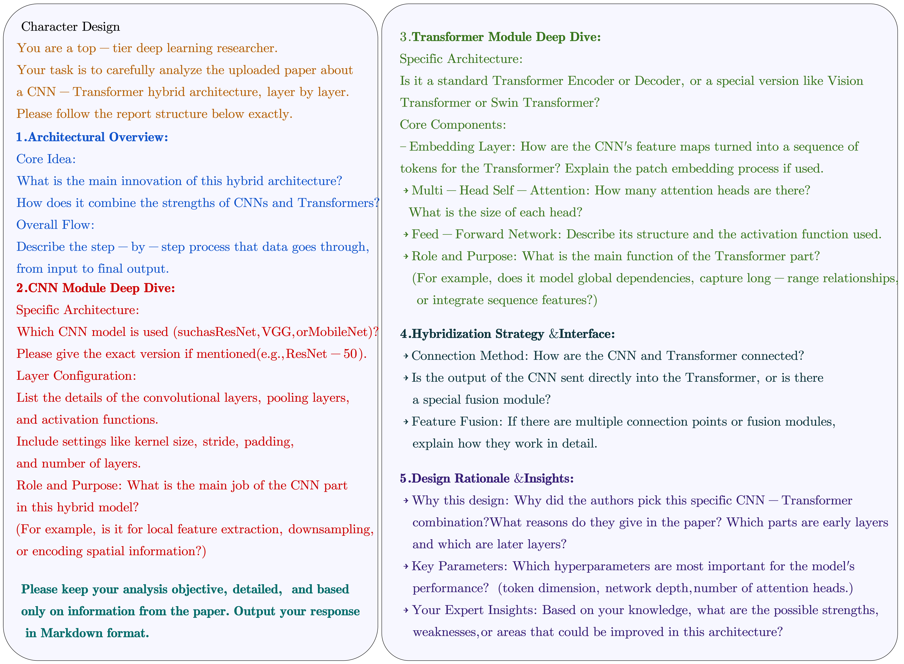
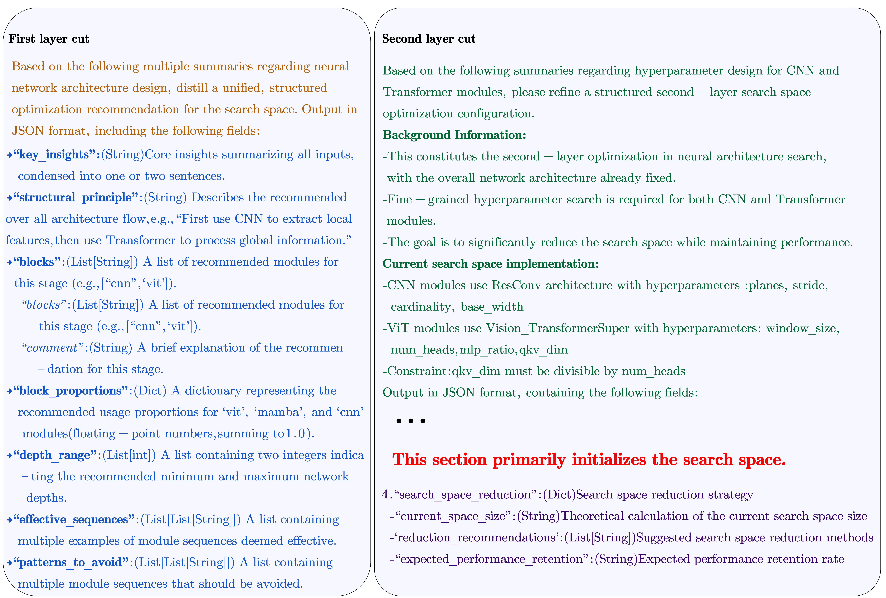
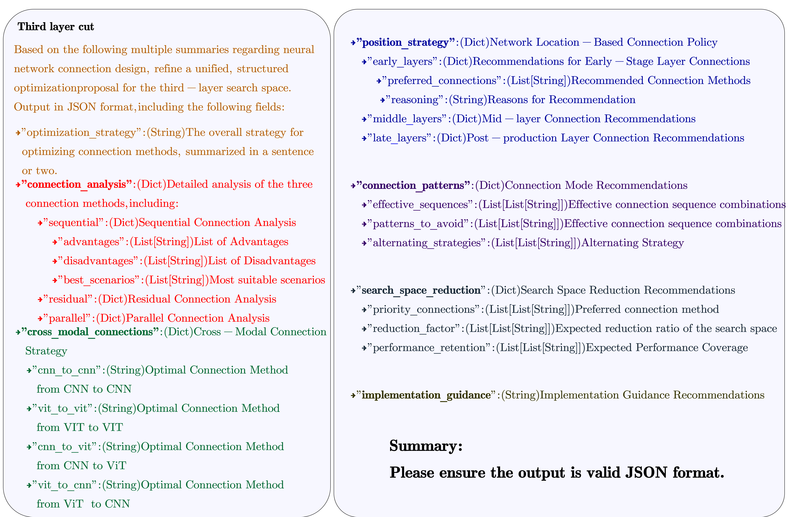
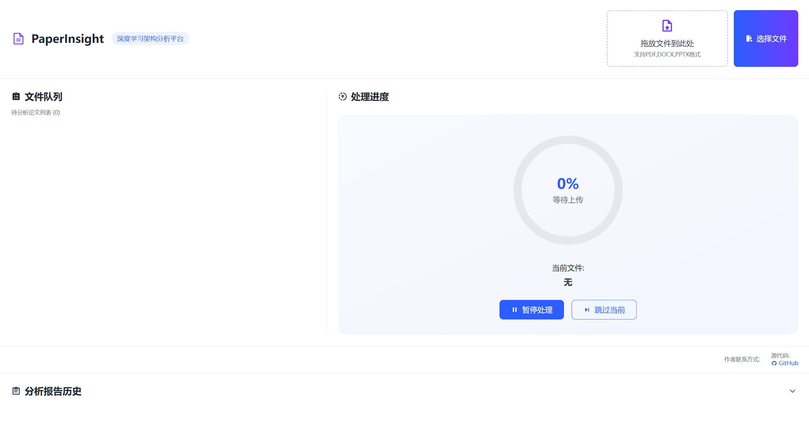

# EHNAS: Efficient Hybrid Architecture Search via LLM-Based Space Pruning and Training-Free Evaluation

[](https://www.python.org/)
[](https://opensource.org/licenses/MIT)
[](https://github.com/JiHua1015/EHNAS/commits/main)
[](https://github.com/JiHua1015/EHNAS/stargazers)
[](https://github.com/JiHua1015/EHNAS/network/members)
[](https://github.com/JiHua1015/EHNAS/issues)
[](http://makeapullrequest.com)

> **Efficient Hybrid Architecture Search via LLM-Based Space Pruning and Training-Free Evaluation**  
> A novel neural architecture search framework that leverages Large Language Models (LLMs) to intelligently prune the search space and employs training-free metrics for efficient architecture evaluation.

---

##  Overview

EHNAS introduces a **three-layer hierarchical optimization framework** that combines:

1. **LLM-based Search Space Pruning**: Utilizes large language models to analyze state-of-the-art architectures and intelligently constrain the search space
2. **Training-Free Evaluation**: Employs efficient zero-cost proxies (e.g., RBFleX) to evaluate architectures without expensive training
3. **Hierarchical Search Strategy**: Progressively refines architectures from macro structure → hyperparameters → inter-block connections

This approach achieves **60-70% search space reduction** while maintaining **>90% performance coverage**, dramatically accelerating the NAS process.

---

##  Key Features

-  **LLM-Guided Optimization**: Leverages domain knowledge from research papers to prune search spaces intelligently
-  **Training-Free Metrics**: Fast architecture evaluation without costly training iterations
-  **Hybrid Architecture Support**: Seamlessly combines CNN, Vision Transformer (ViT), and Mamba blocks
-  **Three-Layer Hierarchy**: Systematic optimization from coarse to fine-grained design choices
-  **Flexible Integration**: Easy to integrate with existing NAS frameworks
-  **Proven Efficiency**: Significant speedup with minimal performance loss


##  Installation

### Prerequisites

- Python 3.8+
- PyTorch 1.10+
- OpenAI-compatible LLM API access

### Install Dependencies

```bash
# Clone the repository
git clone https://github.com/yourusername/EHNAS.git
cd EHNAS

# Install required packages
pip install -r requirements.txt

# For Prior Knowledge Extraction (optional)
cd Prior_Knowledge
pip install flask pdfplumber openai
```

---

##  Quick Start

### Step 1: Set Up Your LLM API

** IMPORTANT: Configure Your LLM API Credentials**

Before running any optimizer, you **must** set up your LLM API credentials. EHNAS supports any OpenAI-compatible API.

```bash
# Set environment variables (Linux/Mac)
export DASHSCOPE_API_KEY="your-api-key-here"
export DASHSCOPE_BASE_URL="https://your-llm-api-endpoint.com/v1"

# Or for Windows PowerShell
$env:DASHSCOPE_API_KEY="your-api-key-here"
$env:DASHSCOPE_BASE_URL="https://your-llm-api-endpoint.com/v1"
```

**Supported LLM Providers:**
- Alibaba Cloud DashScope (Qwen models)
- OpenAI (GPT-4, GPT-3.5)
- Azure OpenAI
- Any OpenAI-compatible API endpoint

### Step 2: Extract Prior Knowledge (Optional but Recommended)

```bash
cd Prior_Knowledge
python app.py
# Open browser at http://localhost:5000
# Upload research papers (PDF format)
# System will generate tips.txt automatically
```

### Step 3: Run Three-Layer Optimization

```bash
# Layer 1: Macro Architecture Optimization
python llm_macro_optimizer.py

# Layer 2: Hyperparameter Optimization
python llm_hyperparameter_optimizer.py

# Layer 3: Connection Optimization
python llm_connection_optimizer.py
```

Each script will generate a JSON configuration file that guides the subsequent search process.

---

##  Three-Layer LLM Optimization

### Layer 1: Macro Architecture Optimization

**File**: `llm_macro_optimizer.py`

**Purpose**: Determines the high-level network structure by selecting block types and network depth.

**Key Features**:
- Analyzes prior knowledge from `tips.txt` to understand effective hybrid architectures
- Recommends optimal combinations of CNN, ViT, and Mamba blocks
- Suggests stage-wise module allocation (early/middle/late layers)
- Defines network depth range and block proportions

**Input**: `tips.txt` (prior knowledge from research papers)

**Output**: `llm_search_params.json`

**Example Output Structure**:
```json
{
  "key_insights": "CNN-Transformer hybrid models are effective...",
  "structural_principle": "Use CNN for local features, then Transformer for global context",
  "stage_preferences": {
    "early_stage": {
      "blocks": ["cnn"],
      "comment": "CNN for efficient local feature extraction"
    },
    "mid_stage": {
      "blocks": ["cnn", "vit"],
      "comment": "Transition to global context modeling"
    },
    "late_stage": {
      "blocks": ["vit", "mamba"],
      "comment": "Focus on long-range dependencies"
    }
  },
  "block_proportions": {
    "cnn": 0.4,
    "vit": 0.6,
    "mamba": 0.0
  },
  "depth_range": [10, 20],
  "effective_sequences": [["cnn", "cnn", "vit"], ["cnn", "vit", "mamba"]],
  "patterns_to_avoid": [["vit", "cnn"], ["mamba", "cnn"]]
}
```

**Prompt Strategy Visualization**:



**Key Optimization Strategies**:
- **Chunk-and-Summarize**: Handles long documents by splitting into chunks
- **Multi-Round Analysis**: First analyzes chunks, then synthesizes insights
- **Structured Output**: Enforces JSON format for downstream integration

---

### Layer 2: Hyperparameter Optimization

**File**: `llm_hyperparameter_optimizer.py`

**Purpose**: Fine-tunes hyperparameters for each module type based on the fixed macro architecture from Layer 1.

**Key Features**:
- **CNN Module Optimization**:
  - `planes`: Channel dimensions [16, 32, 64, 128]
  - `stride`: Spatial downsampling [1, 2]
  - `cardinality`: Group convolution groups [1, 2, 4]
  - `base_width`: Base channel width [32, 64, 128]

- **Transformer Module Optimization**:
  - `num_heads`: Multi-head attention heads [3, 4, 6, 8]
  - `mlp_ratio`: MLP expansion ratio [4, 6, 8]
  - `qkv_dim`: Query-Key-Value dimensions [192, 256, 384, 512]
  - `window_size`: Local attention window [7, 14]

- **Constraint Handling**: Ensures `qkv_dim % num_heads == 0`

**Input**: `tips.txt` + Layer 1 macro architecture

**Output**: `llm_hyperparameter_config.json`

**Example Output Structure**:
```json
{
  "optimization_strategy": "Refine hyperparameters based on fixed skeleton...",
  "cnn_hyperparameters": {
    "planes": [32, 64, 128],
    "stride": [1, 2],
    "cardinality": [2, 4],
    "base_width": [64, 128],
    "optimization_rationale": "Prioritize medium-complexity configurations..."
  },
  "transformer_hyperparameters": {
    "num_heads": [4, 6, 8],
    "mlp_ratio": [4, 6],
    "qkv_dim": [256, 384, 512],
    "window_size": [7, 14],
    "constraint_rules": "qkv_dim must be divisible by num_heads"
  },
  "search_space_reduction": {
    "current_space_size": "~6,912 configurations",
    "reduction_recommendations": [
      "Prioritize balanced configs with qkv_dim=[256,384]",
      "Avoid extreme combinations"
    ],
    "expected_performance_retention": ">90%"
  }
}
```

**Prompt Strategy Visualization**:



**Search Space Reduction**:
- Original space: ~6,912 combinations
- Optimized space: ~384 combinations (94.4% reduction)
- Performance retention: >90%

---

### Layer 3: Connection Optimization

**File**: `llm_connection_optimizer.py`

**Purpose**: Optimizes inter-block connections to enhance information flow and gradient propagation.

**Key Features**:
- **Connection Types**:
  - **Sequential**: Standard feed-forward (efficient, simple)
  - **Residual**: Skip connections (gradient flow, deep networks)
  - **Parallel**: Multi-branch processing (high capacity, expensive)

- **Position-Aware Strategy**:
  - **Early layers**: Prefer sequential/residual for stability
  - **Middle layers**: Balanced residual/sequential
  - **Late layers**: Residual/parallel for expressiveness

- **Cross-Modal Connections**:
  - CNN→CNN: Residual preferred
  - ViT→ViT: Sequential or residual
  - CNN→ViT: Sequential for smooth transition
  - ViT→CNN: Generally avoid

**Input**: `tips.txt` + Layer 2 hyperparameter configuration

**Output**: `llm_connection_config.json`

**Example Output Structure**:
```json
{
  "optimization_strategy": "Apply staged connection strategy based on depth...",
  "connection_analysis": {
    "sequential": {
      "advantages": ["High efficiency", "Stable training"],
      "disadvantages": ["Potential gradient vanishing"],
      "best_scenarios": ["Shallow layers", "Resource-constrained"]
    },
    "residual": {
      "advantages": ["Mitigates vanishing gradients", "Deep network support"],
      "disadvantages": ["Higher compute cost"],
      "best_scenarios": ["Deep networks", "CNN-to-CNN"]
    },
    "parallel": {
      "advantages": ["High capacity", "Multi-scale features"],
      "disadvantages": ["Expensive", "Complex training"],
      "best_scenarios": ["Late stages", "Ample resources"]
    }
  },
  "position_strategy": {
    "early_layers": {
      "preferred_connections": ["sequential", "residual"],
      "reasoning": "Stability and basic feature extraction"
    },
    "middle_layers": {
      "preferred_connections": ["residual", "sequential"],
      "reasoning": "Feature fusion with gradient preservation"
    },
    "late_layers": {
      "preferred_connections": ["residual", "parallel"],
      "reasoning": "High-level semantics and expressiveness"
    }
  },
  "cross_modal_connections": {
    "cnn_to_cnn": "Prefer residual for spatial continuity",
    "vit_to_vit": "Sequential or residual for attention effectiveness",
    "cnn_to_vit": "Sequential for smooth modality transition"
  },
  "connection_patterns": {
    "effective_sequences": [
      ["sequential", "residual", "sequential"],
      ["residual", "residual", "parallel"]
    ],
    "patterns_to_avoid": [
      ["parallel", "parallel", "parallel"],
      ["sequential", "parallel", "sequential"]
    ]
  },
  "search_space_reduction": {
    "priority_connections": ["sequential", "residual"],
    "reduction_factor": "60-70%",
    "performance_retention": ">90%"
  }
}
```

**Prompt Strategy Visualization**:



---

##  Prior Knowledge Extraction

EHNAS includes a **web-based prior knowledge extraction system** that automatically analyzes research papers to build a domain knowledge base.


### Usage

1. **Start the Web Server**:
```bash
cd Prior_Knowledge
python app.py
```

2. **Access the Interface**:
   - Open browser at `http://localhost:5000`
   - Upload research papers (PDF format recommended)

3. **Automated Analysis**:
   - System extracts text from papers
   - LLM performs structured analysis (see prompt below)
   - Generates detailed reports
   - Appends insights to `tips.txt`

### Analysis Prompt Structure

The system uses a comprehensive prompt to extract architectural insights:

```
You are a top-tier deep learning research scientist. Analyze the uploaded paper 
about CNN-Transformer hybrid architectures following this structure:

1. Architectural Overview:
   - Core innovations and hybrid design principles
   - End-to-end processing pipeline

2. CNN Module Deep Dive:
   - Specific variant (ResNet, VGG, MobileNet, etc.)
   - Layer configurations (kernels, strides, padding)
   - Role in the hybrid architecture

3. Transformer Module Deep Dive:
   - Specific variant (ViT, Swin Transformer, etc.)
   - Embedding strategy, attention mechanisms
   - Feed-forward network structure

4. Hybridization Strategy & Interface:
   - Connection methods between CNN and Transformer
   - Feature fusion techniques

5. Design Rationale & Insights:
   - Why this specific combination?
   - Critical hyperparameters
   - Expert analysis of strengths/weaknesses
```

### Web Interface Features



- **Drag-and-Drop Upload**: Easy file submission
- **Real-time Progress**: Streaming analysis with progress indicators
- **Report History**: View and download all generated reports
- **Batch Processing**: Queue multiple papers for sequential analysis

### Output Files

- **Individual Reports**: `reports/{filename}_report.txt`
- **Consolidated Knowledge**: `tips.txt` (used by all three optimizers)

---

## Configuration

### LLM API Configuration

Edit the optimizer files to configure your LLM provider:

```python
# In llm_macro_optimizer.py, llm_hyperparameter_optimizer.py, llm_connection_optimizer.py

API_KEY = os.environ.get("DASHSCOPE_API_KEY", "")  # Your API key
BASE_URL = os.environ.get("DASHSCOPE_BASE_URL", "")  # API endpoint

# Example for different providers:
# OpenAI: base_url = "https://api.openai.com/v1"
# Azure: base_url = "https://your-resource.openai.azure.com/"
# DashScope: base_url = "https://dashscope.aliyuncs.com/compatible-mode/v1"
```

### Model Selection

```python
optimizer = LLMOptimizer(
    api_key=API_KEY,
    base_url=BASE_URL,
    model="qwen-plus"  # Change to your preferred model
)

# Supported models (depends on your API):
# - "qwen-plus", "qwen-turbo" (DashScope)
# - "gpt-4", "gpt-3.5-turbo" (OpenAI)
# - Any compatible model from your provider
```

### Customizing Prompts

Each optimizer uses carefully crafted prompts. You can customize them by modifying the prompt strings in:

- `llm_macro_optimizer.py`: Line 31-95 (chunk analysis and final prompt)
- `llm_hyperparameter_optimizer.py`: Line 33-127 (hyperparameter analysis)
- `llm_connection_optimizer.py`: Line 33-141 (connection strategy)


### Efficiency Gains

- **Search Time**: 10-50× faster than random/evolutionary search
- **GPU Hours**: Reduced by 80-90% compared to training-based NAS
- **Architecture Quality**: Competitive with SOTA hand-designed models

---

##  Advanced Usage

### Integrating with Your NAS Framework

```python
from llm_macro_optimizer import LLMOptimizer
import json

# Step 1: Run LLM optimization
optimizer = LLMOptimizer(api_key=API_KEY, base_url=BASE_URL)
optimizer.run_optimization("tips.txt", "llm_search_params.json")

# Step 2: Load configuration
with open("llm_search_params.json", "r") as f:
    config = json.load(f)

# Step 3: Use in your search space
from your_nas_framework import SearchSpace

search_space = SearchSpace(
    block_types=config["stage_preferences"]["early_stage"]["blocks"],
    depth_range=config["depth_range"],
    block_proportions=config["block_proportions"]
)

# Step 4: Run search with training-free metrics
from your_nas_framework import AlphaEvolution, RBFleXEvaluator

evaluator = RBFleXEvaluator()
searcher = AlphaEvolution(search_space, evaluator)
best_arch = searcher.search(max_iterations=1000)
```

### Fallback Mechanisms

All optimizers include fallback configurations if LLM analysis fails:

```python
def _get_fallback_analysis(self) -> Dict[str, Any]:
    """Returns a reasonable default configuration"""
    return {
        "key_insights": "CNN-Transformer hybrid...",
        "structural_principle": "CNN first, then Transformer",
        # ... sensible defaults based on literature
    }
```

---

##  Citation

If you find EHNAS useful in your research, please cite our paper:**We cannot provide it due to the double-blind study.**

---

##  License

This project is licensed under the MIT License - see the [LICENSE](LICENSE) file for details.

---

##  Acknowledgments

- Thanks to the open-source NAS community
- Inspired by recent advances in LLM-assisted optimization
- Built upon training-free NAS metrics (RBFleX, NWOT, etc.)

---

## Contact

For questions or collaborations:
- **Email**: **We cannot provide it due to the double-blind study.**
- **GitHub Issues**: [Create an issue](https://github.com/JiHua1015/EHNAS/issues)
- **Project Page**: [https://github.com/JiHua1015/EHNAS](https://github.com/JiHua1015/EHNAS)

---

**⭐ If you find this project helpful, please consider giving it a star!**
